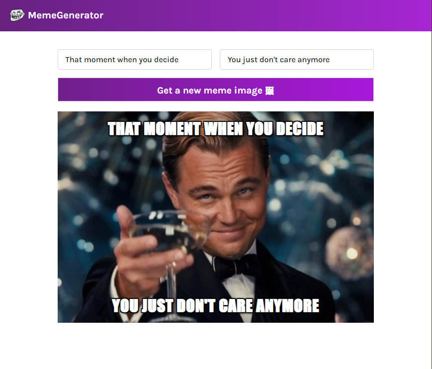

# React -- Meme Generator

This is a solution to the Meme Generator project on Scrimba. 

## Table of contents

- [Overview](#overview)
  - [The challenge](#the-challenge)
  - [Screenshot](#screenshot)
  - [Links](#links)
- [My process](#my-process)
  - [Built with](#built-with)
  

## Overview

### The challenge

Create a Meme Generator using React JS. 

### Screenshot

### Links

- Live Site URL: [https://lidijaalmemegenerator.netlify.app/](https://lidijaalmemegenerator.netlify.app/)

## My process

### Built with

- HTML
- CSS
- React JS
- API
